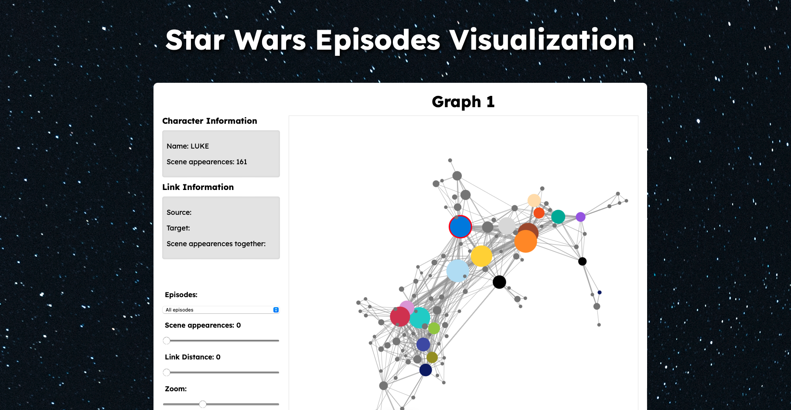

# Star Wars Episodes Visualization 🌌

This project is an interactive visualization tool that explores character interactions across different episodes of Star Wars. The tool allows users to explore how characters from various Star Wars episodes interact with each other through force-directed node-link diagrams.

## Features

- **Episode Selection**: Users can switch between visualizations of different episodes or see interactions across all episodes.
- **Character Details**: Hover over nodes to view character information and appearance frequency.
- **Link Information**: Highlight relationships between characters, showing the number of scenes they appear in together.
- **Interactive Controls**: 
  - Adjust node size based on scene appearances.
  - Zoom in/out and adjust link distances to explore the graph.
  - See character details and connections dynamically as you interact.

## Tech Stack

- **Frontend**: HTML, CSS
- **Visualization**: D3.js
- **Data**: JSON format containing character interaction data for seven Star Wars episodes

